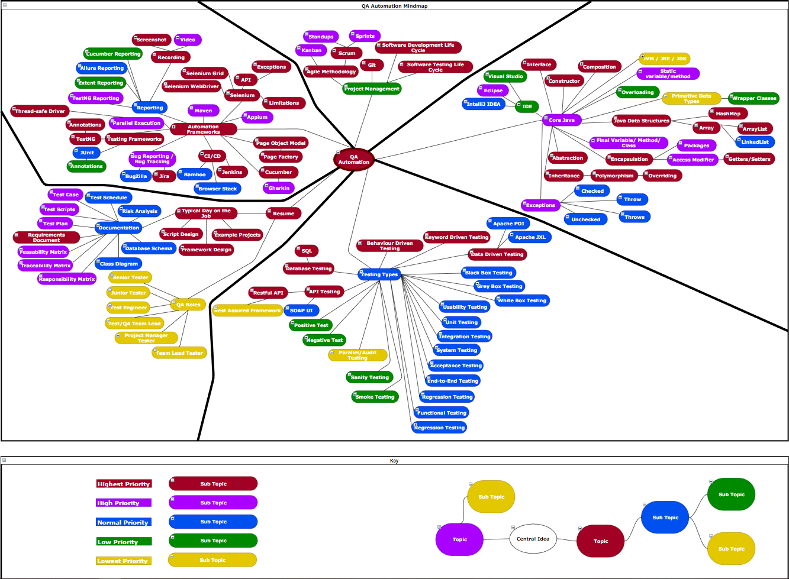

# devopsqa = Development + Operations + Quality Assurance

Development + Operations + Quality Assurance knowledge all in one place.

<u><b>FOR RECRUITERS + INTERVIEWERS:</b></u>

- To see the knowledge I've gathered here in these markdown files relating to QA Automation: <b><a href=https://github.com/h1ddengames/devopsqa/blob/master/QA/QA-Automation-Mindmap/STLC-IN-DEPTH.md>Software Testing Life Cycle in-depth</a></b> AND <a href=https://github.com/h1ddengames/devopsqa/blob/master/QA/QA-Automation-Mindmap/Automation-Frameworks.md>Automation Frameworks</a> AND <a href=https://github.com/h1ddengames/devopsqa/blob/master/QA/QA-Automation-Mindmap/Testing-Types.md>Testing Types</a>

- To minimize the amount of time you need to verify my QA skills, use this link to see a showcase of my skills: <a href=https://github.com/h1ddengames/devopsqa/tree/master/QA/QA-Automation-Mindmap/Testing/db-api-jenkins/jenkins/home/qashowcase/src/main/java>QA Showcase As a Java Project</a>

#
## Opening Notes

Everything related to DevOps will be in the DevOps/Hosting-Skills folder.

Everything related to quality assurance will be in the QA/QA-Automation-Mindmap folder.

- This repository contains all the knowledge I've gained from working in QA and going to college to learn DevOps skills.

- I made this repository in the hopes that it will help others rid themselves of impostor syndrome.
- The idea that I had while making this was that if someone were to be shown a visual of all the things they needed to know, they would be less fearful of not belonging or feeling inferior to their peers.
- The visualization is in the form of a mind map that links similar concepts together with a core concept in the middle.

<b> A LARGER VERSION OF THE IMAGE BELOW HAS BEEN PROVIDED IN THE QA/QA-Automation-Mindmap FOLDER. </b>

<b> IN ORDER TO USE THE DRAWIO FILE EITHER GO TO DRAW.IO AND IMPORT IT INTO THE ONLINE EDITOR OR DOWNLOAD THE HTML FILE AND OPEN IT </b>

#
## QA Automation

The QA/QA-Automation-Mindmap folder contains all the documentation on the following:

- Core-Java - The minimum required Java that will be required for job interviews and doing QA work.
- Automation-Frameworks - Several types of automation frameworks, how to set them up, and how to use them.
- Project-Management - How to plan and manage a project.
- Testing-Types - The many different testing types in QA.
- Resume - The types of things that you should know when working in QA.

#
## DevOps

The DevOps/Hosting-Skills folder contains all the documentation on the following:

- Self-Hosting - Hosting programs on a VM or local machine.
- AWS-Hosting - Hosting programs on AWS (usually on an EC2 instance)
- Vagrantfiles - Vagrant is used heavily in the DevOps section of this repository in order to quickly create a working VM.
  - I have to use Windows as my host because of programs that I cannot replace with Linux alternatives. Since I don't have Windows 10 Pro, I can't just use Docker locally so I have to create a VM then use Docker inside these VMs.
